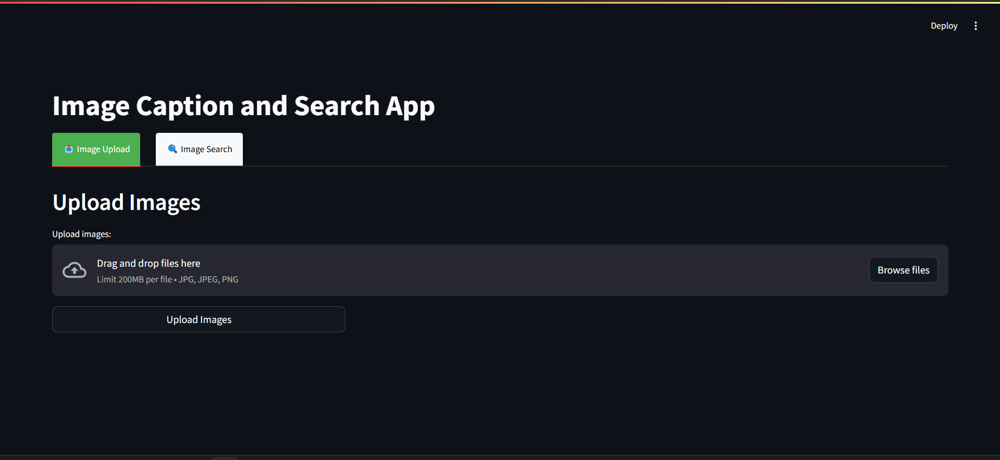

# Image Caption and Search Application

A powerful application that uses AI to automatically caption images and make them searchable by text. This application demonstrates the integration of modern AI image understanding capabilities with a user-friendly search interface.



## Features

- **AI-Powered Image Captioning**: Automatically generate detailed captions for uploaded images using state-of-the-art machine learning models
- **Smart Search**: Find images using natural language search terms
- **Keyword Extraction**: Automatically extracts relevant keywords from image captions
- **Parallel Processing**: Process multiple images simultaneously for faster uploads
- **User-Friendly Interface**: Clean, responsive interface built with Streamlit
- **Thumbnail Generation**: Create and store thumbnails for efficient image display

## Technologies Used

- **Streamlit**: For building the web interface
- **Hugging Face Transformers**: BLIP (Bootstrapping Language-Image Pre-training) model for image captioning
- **NLTK & TextBlob**: For natural language processing and keyword extraction
- **PIL (Python Imaging Library)**: For image manipulation and thumbnail generation
- **Concurrent Processing**: ThreadPoolExecutor for parallel image processing

## Requirements

- Python 3.7+
- Required Python packages (see `requirements.txt`)

## Installation

1. Clone this repository:
   ```
   git clone https://github.com/Preyanshz/image-text-search.git
   cd image-text-search
   ```

2. Create and activate a virtual environment (optional but recommended):
   ```
   python -m venv venv
   source venv/bin/activate  # On Windows: venv\Scripts\activate
   ```

3. Install required packages:
   ```
   pip install -r requirements.txt
   ```

## Usage

1. Start the application:
   ```
   streamlit run app.py
   ```

2. The application will open in your default web browser.

3. **Uploading Images**:
   - Navigate to the "Image Upload" tab
   - Click "Browse files" to select images from your computer
   - Select single or multiple images
   - Click "Upload Images" to begin the processing
   - The application will display progress as it captions each image

4. **Searching Images**:
   - Navigate to the "Image Search" tab
   - Enter search terms in the text input field
   - Click "Search Images"
   - The application will display all images that match your search criteria
   - Browse available keywords in the sidebar to discover searchable terms

## How It Works

1. **Image Upload Process**:
   - Images are uploaded and saved in the 'Images' directory
   - Thumbnails are generated and saved in the 'Thumbnails' directory
   - Each image is processed by the BLIP AI model to generate descriptive captions
   - Captions are processed to remove stop words and normalize to singular forms
   - Keywords are extracted and saved to the database

2. **Search Process**:
   - User enters search terms
   - Terms are processed (singularized and lowercased)
   - The application searches the database for images with matching keywords
   - Matching images are displayed in a responsive grid

## Project Structure

```
image-text-search/
├── app.py            # Main application file
├── database.txt      # JSON database storing image keywords
├── Images/           # Directory for storing original uploaded images
├── Thumbnails/       # Directory for storing image thumbnails
└── requirements.txt  # Python dependencies
```

## Creating requirements.txt

To create the necessary requirements file, run:

```
pip install pipreqs
pipreqs .
```

Or manually create a requirements.txt file with:

```
streamlit==1.24.0
Pillow==9.5.0
transformers==4.30.2
nltk==3.8.1
textblob==0.17.1
torch==2.0.1
```

## Note

This application requires downloading large AI model files on first run, which may take some time depending on your internet connection.

## License

[MIT License](LICENSE)

## Contributing

Contributions are welcome! Please feel free to submit a Pull Request.